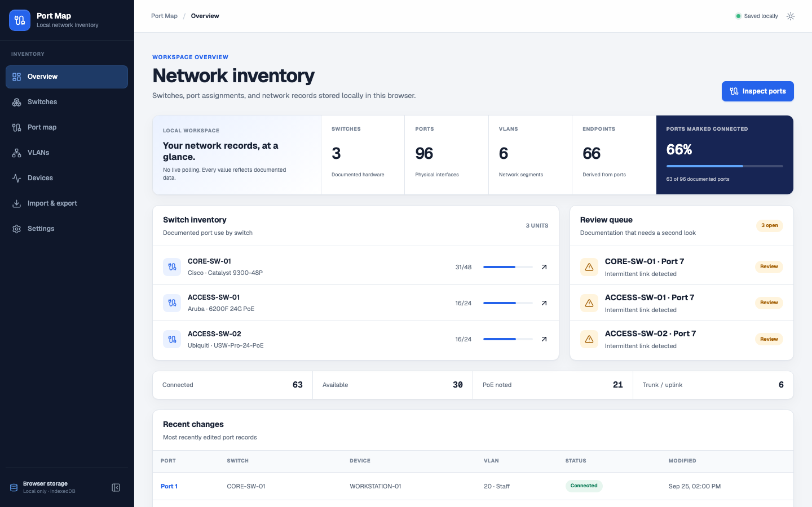
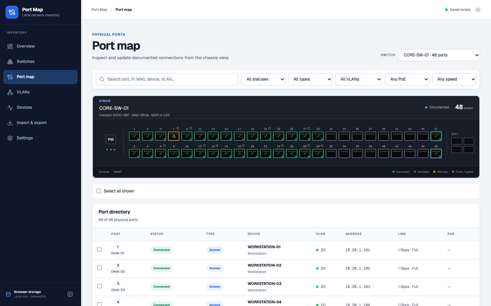

<div align="center">
  
  <h1>Port Map</h1>
  <p><strong>Visual switch port management for network teams.</strong></p>

[](https://github.com/rahmankutlu/port-map/actions/workflows/ci.yml)
[](LICENSE)
[](https://nextjs.org/)
[](#data-and-privacy)

[Open live demo](https://rahmankutlu.github.io/port-map/) · [Download v0.1.1](https://github.com/rahmankutlu/port-map/releases/tag/v0.1.1) · [Report an issue](https://github.com/rahmankutlu/port-map/issues/new/choose)
</div>

Port Map is a local-first application for documenting network switches, physical ports, VLAN assignments, PoE endpoints, and connected devices. It gives IT technicians, system administrators, and NOC teams a compact operational view without requiring a server or account.

> [!IMPORTANT]
> All data stays in the browser. No account, server, telemetry service, or external database is required.

Port Map is local-first: it has no account system, backend, or telemetry. It
documents user-entered network data but does not monitor switches. SNMP
discovery is not currently implemented.

## Interface preview



<details>
<summary>View the physical port workspace</summary>
<br />



</details>

## Why Port Map?

Port documentation often ends up fragmented across spreadsheets, switch configurations, and tribal knowledge. Port Map provides one visual workspace for recording the physical and logical state of a switch estate while remaining straightforward to deploy: open the application and start documenting.

## Features

- Realistic 8, 16, 24, 48, and custom-count switch port layouts
- Fast in-place port editing for VLANs, endpoint details, speed, duplex, PoE, and notes
- Multi-port selection and bulk VLAN, type, state, location, note, and clear operations
- Search across ports, addresses, devices, VLANs, and descriptions with instant filters
- Switch and VLAN inventory with validated VLAN IDs
- Device inventory derived automatically from documented port connections
- Versioned, Zod-validated JSON import and export
- Browser-local IndexedDB persistence, manual backups, and guarded restore
- Light, dark, and system themes; responsive navigation and horizontally scrollable hardware panels
- Keyboard-accessible controls and status cues that do not rely on color alone

## Technology

- Next.js 16 App Router and React 19
- Strict TypeScript
- Tailwind CSS 4 plus a compact, token-based design system
- Lucide icons
- IndexedDB through `idb`
- Zod runtime validation
- Vitest, Testing Library, and Playwright

## Installation

Requirements: Node.js 20.9 or newer and pnpm 10.

```bash
git clone https://github.com/rahmankutlu/port-map.git
cd port-map
pnpm install
pnpm dev
```

Open [http://localhost:3000](http://localhost:3000). The demo workspace is created on the first visit. You can also explore the public [live demo](https://rahmankutlu.github.io/port-map/) without installing anything.

## Commands

| Command          | Purpose                                |
| ---------------- | -------------------------------------- |
| `pnpm dev`       | Start the Turbopack development server |
| `pnpm lint`      | Run ESLint across the repository       |
| `pnpm typecheck` | Type-check without emitting files      |
| `pnpm test`      | Run the Vitest suite                   |
| `pnpm test:e2e`  | Run the Playwright browser smoke test  |
| `pnpm build`     | Create and validate a production build |
| `pnpm start`     | Serve a production build               |

Install the Playwright browser once before the first end-to-end run:

```bash
pnpm exec playwright install chromium
```

## Project structure

```text
src/
├── app/          App Router pages and global styles
├── components/   Shared application shell and UI primitives
├── data/         IndexedDB repository implementation
├── domain/       Zod schemas, types, and seed workspace
├── features/     Feature-level state and editors
├── services/     Pure workspace operations and import/export logic
└── test/         Test environment setup
e2e/              Playwright smoke tests
```

## Architecture

```text
React pages and feature components
              │
              ▼
      Workspace provider
              │
              ▼
 Pure domain services + Zod schemas
              │
              ▼
       IndexedDB repository
```

The browser stores one current workspace and independent backup snapshots. UI components mutate data through the workspace service/provider; they never access IndexedDB directly. Device records are rebuilt from connected-device port fields after port changes, keeping the two views consistent.

The export envelope is explicitly versioned with `schemaVersion`. Imports are parsed as untrusted input, validated at the boundary, and shown for confirmation only after validation succeeds. An automatic backup is created before replacement.

## Data and privacy

Port Map makes no application-level network requests and has no telemetry, user accounts, or server-side storage. Workspace data and backups live in the browser's IndexedDB database for the current site origin. Clearing site data removes them. JSON exports are unencrypted documents; handle them according to your organization's network documentation policy.

Imported files must match the current versioned schema. Port Map validates entity fields and references before presenting the replacement confirmation, then creates a backup of the existing workspace.

Browser data is scoped to the application origin and does not synchronize across browsers or devices. JSON exports are the supported portability and recovery mechanism in v0.1.

## Quality gates

Every pull request runs installation, linting, strict TypeScript checks, unit tests, a production build, and a separate Playwright E2E job in GitHub Actions. The browser suite covers initial demo creation, address validation and normalization, port and bulk editing, refresh persistence, switch and VLAN editing, guarded import, automatic backup and restore, and theme switching.

## Roadmap

- **v0.1** — Local switch, VLAN, device, and port management
- **v0.2** — CSV import/export, reusable port templates, improved search
- **v0.3** — Read-only SNMP discovery
- **v0.4** — Topology visualization
- **v1.0** — Stable export schema and formal migration support

SNMP discovery and topology mapping are roadmap items and are not implemented today.

## Contributing

Issues and pull requests are welcome. Read [CONTRIBUTING.md](CONTRIBUTING.md) before starting a change, use [SUPPORT.md](SUPPORT.md) for help channels, and report security issues according to [SECURITY.md](SECURITY.md).

Useful GitHub topics: `networking`, `network-tools`, `network-management`, `netops`, `switch`, `vlan`, `network-administration`, `nextjs`, `typescript`, `open-source`.

## License

[MIT](LICENSE) © Rahman Kutlu.
